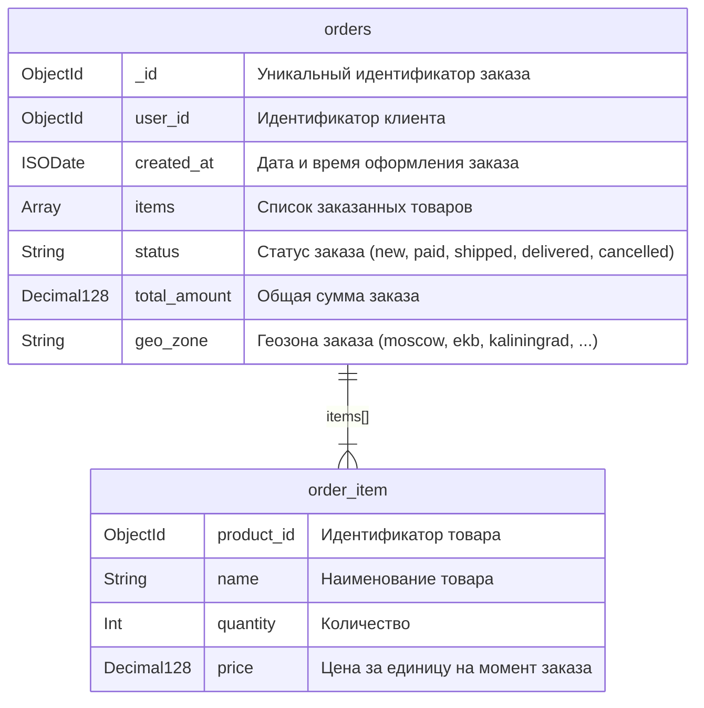
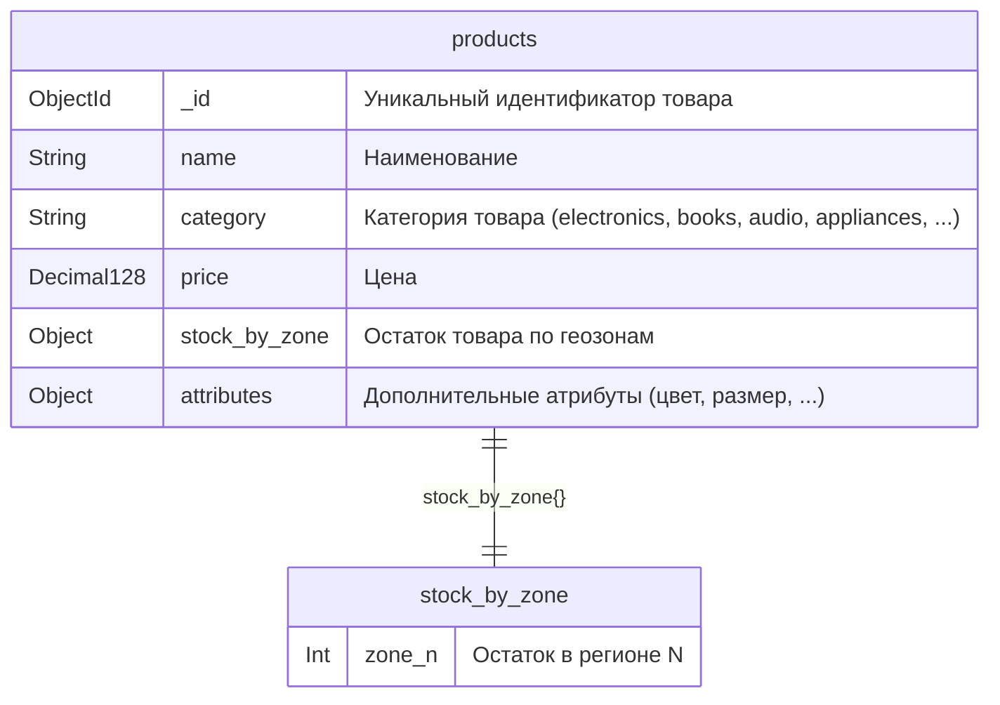
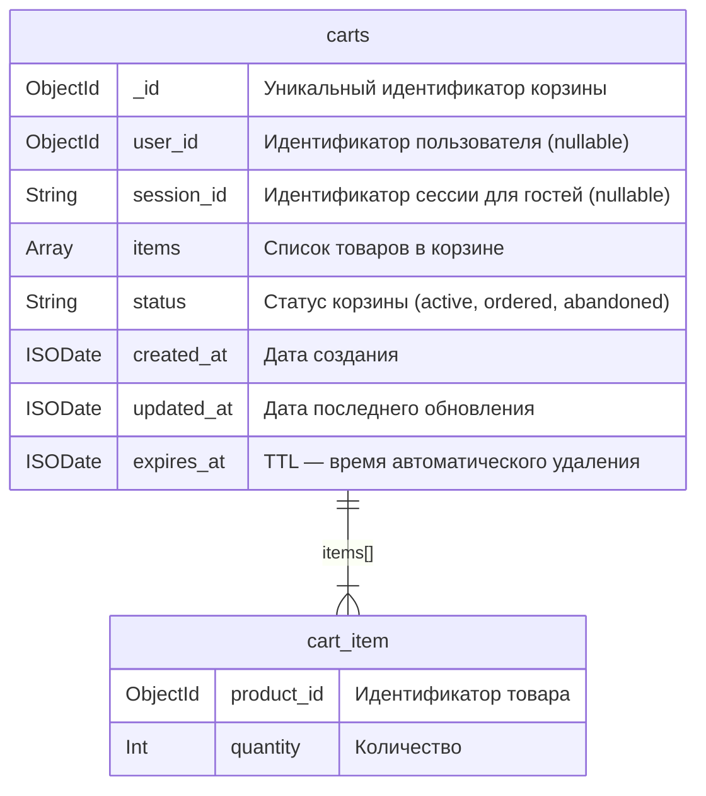
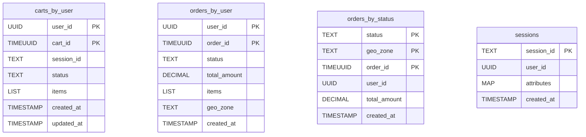

# Задание 7. Проектирование схем коллекций для шардирования данных

## 1. Схемы коллекций

### Коллекция orders



### Коллекция products



### Коллекция carts



---

## 2. Анализ кандидатов для шард-ключей

### orders

| Кандидат                             | Кардинальность | Равномерность                                    | Направленность запросов                                                          | Оценка  |
| ------------------------------------ | -------------- | ------------------------------------------------ | -------------------------------------------------------------------------------- | ------- |
| `user_id`                            | Высокая        | Средняя (hot-пользователи создают много заказов) | Основной паттерн — история заказов конкретного пользователя                      | Хорошо  |
| `user_id` + `created_at` (составной) | Очень высокая  | Высокая                                          | Совпадает с основным паттерном + монотонность `created_at` разбивается `user_id` | Отлично |

### products

| Кандидат                       | Кардинальность | Равномерность | Направленность запросов                                                               | Оценка  |
| ------------------------------ | -------------- | ------------- | ------------------------------------------------------------------------------------- | ------- |
| `_id` (ObjectId)               | Высокая        | Высокая       | Страница товара — targeted, но фильтрация по категории/цене — scatter-gather          | Средне  |
| `category` + `_id` (составной) | Высокая        | Высокая       | Фильтрация по категории — targeted; страница товара — targeted (если знаем категорию) | Отлично |

### carts

| Кандидат     | Кардинальность | Равномерность | Направленность запросов                                                            | Оценка |
| ------------ | -------------- | ------------- | ---------------------------------------------------------------------------------- | ------ |
| Hashed `_id` | Высокая        | Очень высокая | Все операции CRUD идут через `_id` (lookup по `_id` после нахождения через индекс) | Хорошо |

---

## 3. Выбранные стратегии шардирования

### 3.1. Коллекция orders

**Шард-ключ:** `{ user_id: 1, created_at: 1 }` (ranged sharding, составной ключ)

**Стратегия:** Range-шардирование по составному ключу.

**Обоснование:**

- **Направленность запросов - все заказы пользователя на одном шарде. Запрос статуса — тоже targeted.
- Добавление `created_at` к `user_id` делает каждую комбинацию уникальной.
- **Равномерное распределение.** Новые заказы разных пользователей распределяются по шардам через `user_id`, без hot shard.

### 3.2. Коллекция products

**Шард-ключ:** `{ category: 1, _id: 1 }` (ranged sharding, составной ключ)

**Стратегия:** Range-шардирование по составному ключу.

**Обоснование:**

- **Направленность запросов.** Запрос `find({ category: "electronics" })` — targeted. Обновление остатков `update({ category, _id }, ...)` и страница товара — тоже targeted, так как категория всегда известна из контекста.
- **Высокая кардинальность.** `category` имеет низкую кардинальность (jumbo-чанки), но добавление `_id` вторым полем обеспечивает уникальность и позволяет дробить чанки внутри категории.
- **Фильтрация по цене.** Запрос направляется на шарды по `category` (targeted), а фильтрация по `price` выполняется внутри шарда по индексу `{ category: 1, price: 1 }`.

### 3.3. Коллекция carts

**Шард-ключ:** `{ _id: "hashed" }` (hashed sharding)

**Стратегия:** Hashed-шардирование по `_id`.

**Обоснование:**

- **Дуальная природа корзин.** Ни `user_id` (у гостей `null` — все на одном шарде), ни `session_id` (отсутствует у зарегистрированных) не подходят как шард-ключ. Hashed `_id` равномерно распределяет корзины независимо от типа пользователя.
- **Паттерн доступа.** Поиск по `{ session_id, status }` / `{ user_id, status }` — scatter-gather, но приемлемо: корзин немного (TTL чистит старые), запросы возвращают 0–1 документ и покрыты индексами. Обновление по `_id` — targeted.
- **Почему не range по `_id`.** ObjectId монотонно возрастает — все новые корзины попадали бы на один hot shard. Hashing решает эту проблему.

---

## 4. Сводная таблица

| Коллекция  | Шард-ключ                       | Стратегия | Основной выигрыш                                                                      |
| ---------- | ------------------------------- | --------- | ------------------------------------------------------------------------------------- |
| `orders`   | `{ user_id: 1, created_at: 1 }` | Range     | Targeted-запросы по истории заказов пользователя; равномерное распределение вставок   |
| `products` | `{ category: 1, _id: 1 }`       | Range     | Targeted-запросы по каталогу категорий; эффективное обновление остатков               |
| `carts`    | `{ _id: "hashed" }`             | Hashed    | Равномерное распределение при дуальной природе владельцев (user/guest); нет hot shard |

---

# Задание 8. Выявление и устранение «горячих» шардов

## Проблема

Коллекция `products` шардирована по `{ category: 1, _id: 1 }` (range). Категория «electronics» содержит ~70% запросов, и все её документы попадают в смежные чанки на одном-двух шардах. Результат — CPU и IOPS одного шарда на пределе, остальные простаивают.

---

## 1. Метрики мониторинга

| Метрика                     | Источник                                    | Что показывает                     | Порог тревоги                      |
| --------------------------- | ------------------------------------------- | ---------------------------------- | ---------------------------------- |
| Количество операций на шард | `db.serverStatus().opcounters`              | Дисбаланс нагрузки между шардами   | Разброс > 2× от среднего           |
| Количество чанков на шард   | `sh.status()`                               | Неравномерное распределение данных | Разница > 20% от среднего          |
| Размер данных на шард       | `db.collection.stats().shards`              | Перекос хранения                   | Разница > 30% от среднего          |
| CPU / IOPS шарда            | ОС / облачный мониторинг                    | Аппаратная перегрузка              | CPU > 80% или IOPS > 85% от лимита |
| Время ответа (p99) на шард  | MongoDB Profiler (`system.profile`)         | Деградация латенси                 | p99 > 200 мс                       |
| Очередь операций            | `db.serverStatus().globalLock.currentQueue` | Запросы ждут в очереди             | `total` > 50                       |

### Примеры команд для диагностики

```javascript
// Распределение чанков по шардам
db.getSiblingDB("config").chunks.aggregate([
  { $match: { ns: "shop.products" } },
  { $group: { _id: "$shard", count: { $sum: 1 } } },
  { $sort: { count: -1 } }
])

// Статистика по шардам (размер данных, количество документов)
db.products.stats().shards

// Топ медленных запросов
db.getSiblingDB("shop").system.profile
  .find({ ns: "shop.products" })
  .sort({ millis: -1 })
  .limit(5)
```

## 2. Меры устранения дисбаланса

### 2.1. Ручное разделение чанков

Крупные чанки категории «electronics» разбиваются вручную, после чего балансировщик переносит часть на свободные шарды:

```javascript
// Найти границы проблемных чанков
db.getSiblingDB("config").chunks.find({
  ns: "shop.products",
  "min.category": "electronics"
}).sort({ "min._id": 1 })

// Разбить чанк в указанной точке
sh.splitAt("shop.products", {
  category: "electronics",
  _id: ObjectId("65a1f0000000000000000000") // середина диапазона
})
```

### 2.2. Настройка балансировщика

```javascript
// Уменьшить размер чанка — балансировщик будет чаще перемещать данные
db.getSiblingDB("config").settings.updateOne(
  { _id: "chunksize" },
  { $set: { value: 32 } },   // МБ, по умолчанию 128
  { upsert: true }
)

// Задать окно балансировки вне пиковых часов
db.getSiblingDB("config").settings.updateOne(
  { _id: "balancer" },
  { $set: { activeWindow: { start: "02:00", stop: "06:00" } } },
  { upsert: true }
)

// Проверить текущее состояние балансировщика
sh.getBalancerState()
sh.isBalancerRunning()
```

### 2.3. Зонирование (zone sharding)

Принудительно распределить «electronics» по нескольким шардам через зоны:

```javascript
// Назначить шарды в зону
sh.addShardTag("shard01", "hot_electronics")
sh.addShardTag("shard02", "hot_electronics")
sh.addShardTag("shard03", "hot_electronics")

// Привязать диапазон категории к зоне
sh.addTagRange("shop.products",
  { category: "electronics", _id: MinKey },
  { category: "electronics", _id: MaxKey },
  "hot_electronics"
)
```

После этого балансировщик автоматически перенесёт чанки «electronics» так, чтобы они были равномерно распределены между тремя шардами зоны.

### 2.4. Кэширование горячих данных

Снять read-нагрузку с шарда, вынеся популярные товары в кэш:

```javascript
// Пример: кэширование каталога electronics в Redis (псевдокод)
const cacheKey = `products:electronics:page:${page}`;
let products = await redis.get(cacheKey);
if (!products) {
  products = await db.products.find({ category: "electronics" })
    .sort({ _id: 1 }).skip(offset).limit(20).toArray();
  await redis.set(cacheKey, JSON.stringify(products), "EX", 60); // TTL 60 сек
}
```

---

## 3. Предотвращение в будущем

| Мера                           | Описание                                                |
| ------------------------------ | ------------------------------------------------------- |
| Алерты на дисбаланс            | Оповещение при разбросе `opcounters` между шардами > 2× |
| Регулярный аудит `sh.status()` | Еженедельная проверка распределения чанков              |
| Пре-сплит новых категорий      | `sh.splitAt()` заранее, до массового прихода данных     |
| Read-кэш перед MongoDB         | Redis/Memcached для каталога популярных категорий       |

---

# Задание 9. Настройка чтения с реплик и консистентность

## 1. Таблица операций чтения

### Коллекция products

| Операция                                  | Read Preference      | Допустимый лаг | Обоснование                                                                                                  |
| ----------------------------------------- | -------------------- | -------------- | ------------------------------------------------------------------------------------------------------------ |
| Каталог / листинг категории               | `secondaryPreferred` | ≤ 5 сек        | Данные каталога обновляются редко; кратковременная неактуальность цены или описания некритична для просмотра |
| Страница товара (карточка)                | `secondaryPreferred` | ≤ 5 сек        | Аналогично каталогу — пользователь ещё не принимает решение о покупке                                        |
| Проверка остатка при добавлении в корзину | `primary`            | 0              | Риск oversell: если secondary отстаёт, пользователь добавит товар, которого уже нет на складе                |
| Проверка остатка при оформлении заказа    | `primary`            | 0              | Критическая бизнес-операция — списание остатка должно быть строго консистентным                              |

### Коллекция orders

| Операция                         | Read Preference      | Допустимый лаг | Обоснование                                                                                                           |
| -------------------------------- | -------------------- | -------------- | --------------------------------------------------------------------------------------------------------------------- |
| История заказов пользователя     | `secondaryPreferred` | ≤ 3 сек        | Пользователь просматривает прошлые заказы — задержка в пару секунд допустима                                          |
| Статус текущего заказа (трекинг) | `primary`            | 0              | Пользователь ожидает актуальный статус; устаревший статус «оплачен» вместо «отправлен» вызывает обращения в поддержку |
| Аналитика / отчёты               | `secondary`          | ≤ 30 сек       | Отчёты не требуют real-time данных; чтение с secondary разгружает primary                                             |

### Коллекция carts

| Операция                             | Read Preference | Допустимый лаг | Обоснование                                                                                                                                                                |
| ------------------------------------ | --------------- | -------------- | -------------------------------------------------------------------------------------------------------------------------------------------------------------------------- |
| Получение корзины пользователя       | `primary`       | 0              | Корзина обновляется часто (добавление/удаление товаров); чтение устаревшей версии приведёт к потере только что добавленного товара — пользователь решит, что сайт «сломан» |
| Подсчёт брошенных корзин (аналитика) | `secondary`     | ≤ 60 сек       | Фоновая задача, точность в реальном времени не нужна                                                                                                                       |

---

## 2. Допустимая задержка репликации

| Категория операций                          | Максимальный лаг   | Примечание                                  |
| ------------------------------------------- | ------------------ | ------------------------------------------- |
| Критичные (остатки, корзина, статус заказа) | 0 — только primary | Используется readPreference: "primary"      |
| Пользовательские (каталог, история заказов) | ≤ 3–5 сек          | secondaryPreferred + maxStalenessSeconds: 5 |
| Аналитические (отчёты, метрики)             | ≤ 30–60 сек        | secondary + maxStalenessSeconds: 6`         |


**Принцип:** если операция влияет на деньги, остатки или пользователь ожидает мгновенной обратной связи — читаем с primary. Всё остальное безопасно отправлять на secondary для разгрузки primary.

# Задание 10. Миграция на Cassandra: модель данных, стратегии репликации и шардирования

## 10.1. Выбор данных для миграции в Cassandra

### Анализ сущностей

| Сущность                       | Паттерн нагрузки                                                     | Cassandra подходит? | Обоснование                                                                                                                              |
| ------------------------------ | -------------------------------------------------------------------- | ------------------- | ---------------------------------------------------------------------------------------------------------------------------------------- |
| **Корзины (carts)**            | Очень частые записи и чтения; TTL; пиковая нагрузка в чёрную пятницу | **Да**              | Высокая скорость записи, встроенный TTL, leaderless-репликация выдерживает пики без hot shard                                            |
| **Каталог товаров (products)** | Преимущественно чтение; редкие обновления цен/описаний               | **Частично**        | Каталог — да (read-heavy, геораспределение). Остатки — нет (нужны атомарные read-modify-write, которые Cassandra не гарантирует без LWT) |
| **Заказы (orders)**            | Запись при оформлении; частое чтение истории                         | **Да (история)**    | История заказов — append-only, идеально для Cassandra. Создание заказа можно защитить через `QUORUM`                                     |
| **Пользовательские сессии**    | Очень частые записи/чтения; короткий TTL                             | **Да**              | Классический use case для Cassandra: TTL, high-throughput, нет связей между сущностями                                                   |

### Решение

В Cassandra переносим: **carts**, **orders** (с историей), **sessions**. Каталог товаров (products) оставляем в MongoDB — обновление остатков требует атомарных операций, которые в Cassandra возможны только через дорогие Lightweight Transactions.

---

## 10.2. Концептуальная модель данных

### Структуры таблиц



### Первичные ключи и обоснование

| Таблица            | Partition Key | Clustering Key         | Обоснование                                                                                                                                        |
| ------------------ | ------------- | ---------------------- | -------------------------------------------------------------------------------------------------------------------------------------------------- |
| `carts_by_user`    | `user_id`     | `cart_id DESC`         | Один пользователь — одна партиция; TIMEUUID даёт сортировку по времени. Партиции мелкие (1–3 корзины на пользователя), hot partition исключены     |
| `orders_by_user`   | `user_id`     | `order_id DESC`        | Аналогично корзинам. Запрос «мои заказы» — одна партиция. Даже активные покупатели создают сотни заказов, партиция не вырастет до опасного размера |
| `orders_by_status` | `status`      | `geo_zone`, `order_id` | Материализованное представление для фильтрации заказов по статусу. `geo_zone` вторым ключом для фильтрации по региону                              |
| `sessions`         | `session_id`  | —                      | Lookup по ID сессии — единственный паттерн доступа. Каждая партиция — один документ, равномерное распределение                                     |

---

## 10.3. Стратегии обеспечения целостности данных

### Обзор стратегий

| Стратегия               | Как работает                                                                                       | Влияние на latency                         | Когда применять                                   |
| ----------------------- | -------------------------------------------------------------------------------------------------- | ------------------------------------------ | ------------------------------------------------- |
| **Hinted Handoff**      | Координатор сохраняет запись локально, если реплика недоступна, и доставляет её при восстановлении | Нулевое — работает в фоне                  | Кратковременные сбои узлов (секунды–минуты)       |
| **Read Repair**         | При чтении координатор сравнивает ответы реплик и обновляет устаревшие                             | Увеличивает latency чтения на время repair | Данные, которые часто читаются                    |
| **Anti-Entropy Repair** | Фоновый процесс (`nodetool repair`) сравнивает Merkle-деревья всех реплик                          | Нулевое для клиентов (фоновый процесс)     | Редко читаемые данные; периодическое выравнивание |

### Выбор стратегии по сущностям

| Сущность           | Hinted Handoff | Read Repair    | Anti-Entropy Repair | Обоснование                                                                                                                                         |
| ------------------ | -------------- | -------------- | ------------------- | --------------------------------------------------------------------------------------------------------------------------------------------------- |
| `carts_by_user`    | Включён        | Включён (100%) | Раз в 24 ч          | Корзина часто читается и пишется — Read Repair быстро устраняет расхождения. QUORUM на запись гарантирует, что добавленный товар не потеряется      |
| `orders_by_user`   | Включён        | Включён (100%) | Раз в 12 ч          | Заказ — финансовый документ. QUORUM на обе операции обеспечивает strong consistency (R + W > RF). Anti-Entropy чаще, так как потеря заказа критична |
| `orders_by_status` | Включён        | Выключен       | Раз в 24 ч          | Денормализованная таблица для аналитики — допустима eventual consistency, не стоит тратить latency на Read Repair                                   |
| `sessions`         | Включён        | Выключен       | Раз в 7 д           | Сессии короткоживущие (TTL 1 ч). Потеря сессии = повторный логин, не критично. Минимальный latency важнее консистентности                           |

